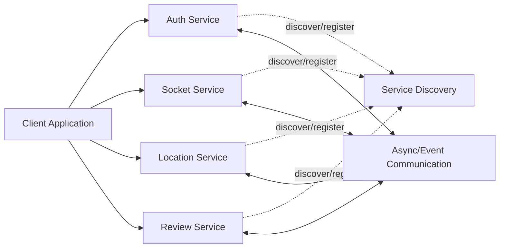

# Uber Microservices Architecture

A documentation repository for my Uber-style ride-hailing backend project.

> This repository explains the architecture, responsibilities, communication patterns, request flows, and engineering decisions behind the individual microservices. The application is split across independent services rather than being implemented as one monolithic backend.

## Services

| Service | Repository | Responsibility |
|---|---|---|
| Authentication Service | `UberProject-AuthService` | User authentication and identity-related operations |
| Service Discovery | `UberProject-ServiceDiscovery` | Service registration and discovery |
| Location Service | `UberProject-LocationService` | Location-related backend operations |
| Socket Service | `UberSocketService` | Real-time client/server communication |
| Review Service | `UberProject-reviewService` | Ratings and reviews |

## High-level architecture

## Why microservices?

The project separates major business capabilities so that each service can be developed, tested, deployed, and scaled independently.

Key benefits:

- Separation of concerns
- Independent deployment
- Independent scaling
- Fault isolation
- Clear ownership of business domains
- Easier evolution of individual components

## Documentation

- [Architecture](ARCHITECTURE.md)
- [Services](SERVICES.md)
- [Request Flow](REQUEST-FLOW.md)
- [Database Design](DATABASE-DESIGN.md)
- [Kafka / Event Communication](KAFKA.md)
- [Socket Communication](SOCKET-IO.md)
- [Service Discovery](SERVICE-DISCOVERY.md)
- [API Documentation](API-DOCUMENTATION.md)
- [Security](SECURITY.md)
- [Deployment](DEPLOYMENT.md)
- [Interview Questions](INTERVIEW-QUESTIONS.md)

## Original service repositories

- https://github.com/Nasir499/UberProject-AuthService
- https://github.com/Nasir499/UberProject-ServiceDiscovery
- https://github.com/Nasir499/UberProject-LocationService
- https://github.com/Nasir499/UberSocketService
- https://github.com/Nasir499/UberProject-reviewService

## Project status

This repository is documentation for the current set of services. As additional ride, driver, payment, notification, or gateway services are implemented, they can be added to the architecture and request-flow documentation.
