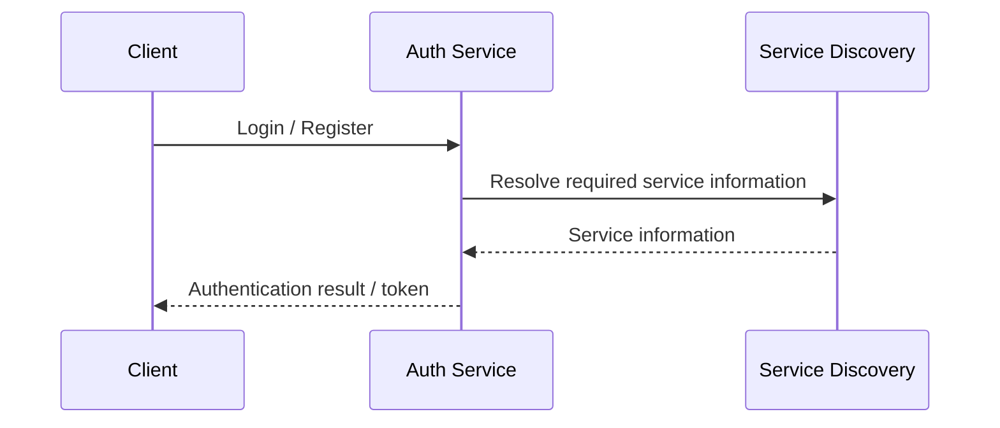
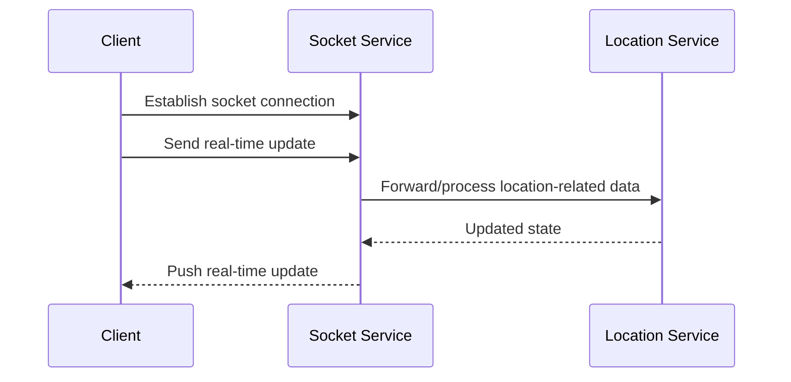
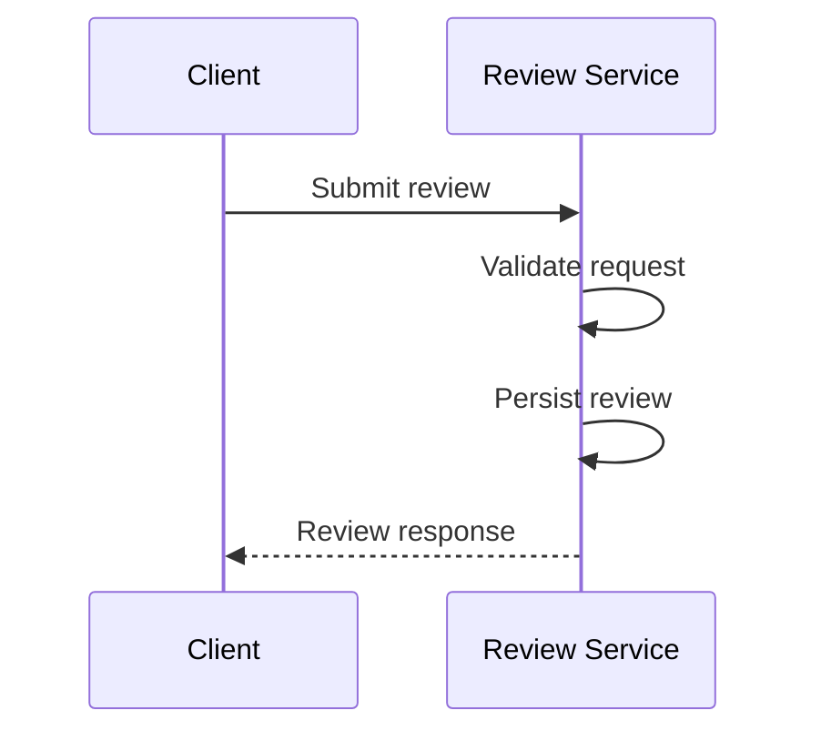

# Request Flows

## Authentication flow

## Real-time communication flow

## Review flow

## Important interview point

The exact request flow should always be derived from the current implementation. Documentation should not claim that a service performs matching, payment, trip management, or notification delivery unless those components actually exist.
