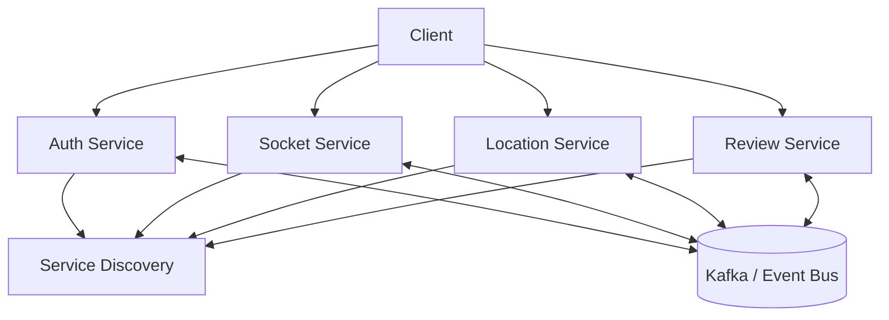

# Architecture Diagram

The following Mermaid diagram can be rendered directly by GitHub Markdown:

## Reading the diagram

- The client interacts with the services required for its operation.
- Service Discovery allows services to locate registered instances.
- Kafka can carry asynchronous domain events.
- Each service maintains a focused responsibility.
